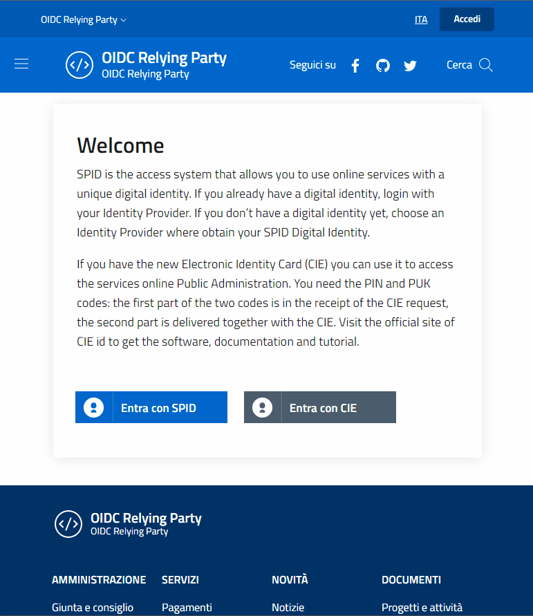

# SPID/CIE OIDC Federation, for Node.js

**SPID/CIE OIDC Federation** is a suite of **Node.js libraries** and **example projects** designed to ease the creation of an Openid Connect Federation.

> ⚠️ This project is a work-in-progress. Currently only the **Relying Party** has been completed.
>
> 👀 Watch this repository over GitHub to stay informed.

| Library                                                | Status                        |
| ------------------------------------------------------ | ----------------------------- |
| **OpenID Connect Federation**                          | ![In roadmap][status-roadmap] |
| **OpenID Connect Identity Provider**                   | ![In roadmap][status-roadmap] |
| [**OpenID Connect Relying Party**][oidc-relying-party] | ![Ready][status-ready]        |

## Packages

### [**SPID/CIE OIDC Federation Relying Party** (`spid-cie-oidc`)][oidc-relying-party] 

A Node.js library that exposes utility functions to configure your web-application endpoints in order to support the SPID/CIE dialect of the OpenID Federation Authentication protocol.

## Example projects

### [**Example Express application (and React)**](examples/express-react-relying-party/README.md)

An example full web server built with Express v4 with the Relying Party library manually integrated (Passport or similar facilities have not been used).

The user-facing application is built with React v17, scaffolded with Create React App v5.

## Useful links

* [Openid Connect Federation](https://openid.net/specs/openid-connect-federation-1_0.html)
* [SPID/CIE OIDC Federation SDK](https://github.com/italia/spid-cie-oidc-django)

## Contribute

Your contribution is welcome, no question is useless and no answer is obvious, we need you.

#### Contribute as end user

Please open an issue if you've discoveerd a bug or if you want to ask some features.

## License and Authors

This software is released under the Apache 2 License by:

- Frederik Batuna <frederik.batuna@smc.it>

### Npm package publishing

A [github action](https://github.com/features/actions) is configured [here](.github\workflows\npm-publish.yml) to publish the package automatically.

To publish a new version of the package create a new release [here](https://github.com/italia/spid-cie-oidc-nodejs/releases/new).

To change npmjs secret ([article](https://dev.to/astagi/publish-to-npm-using-github-actions-23fn)).

[oidc-relying-party]: relying-party/README.md
[status-roadmap]: https://img.shields.io/badge/status-in%20roadmap-inactive
[status-ready]: https://img.shields.io/badge/status-ready-success